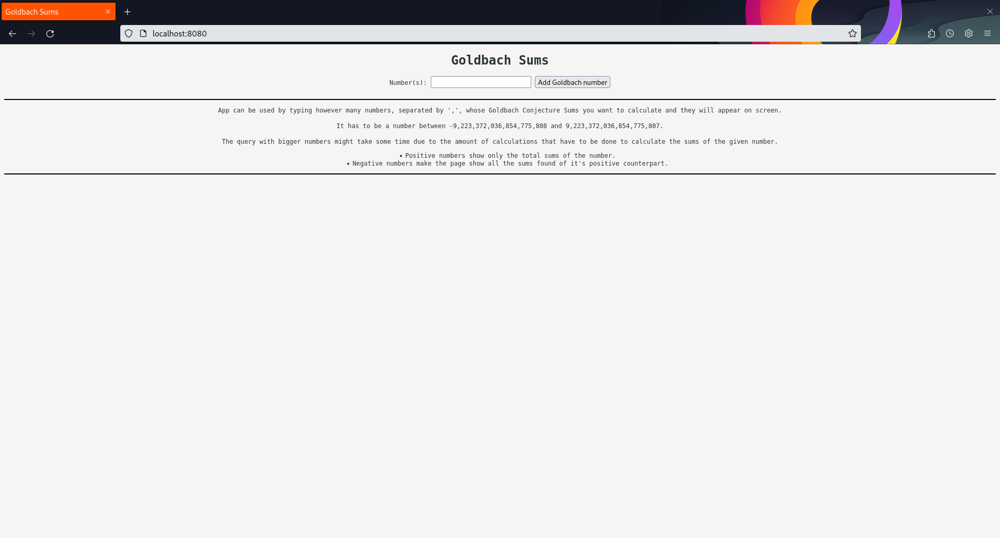
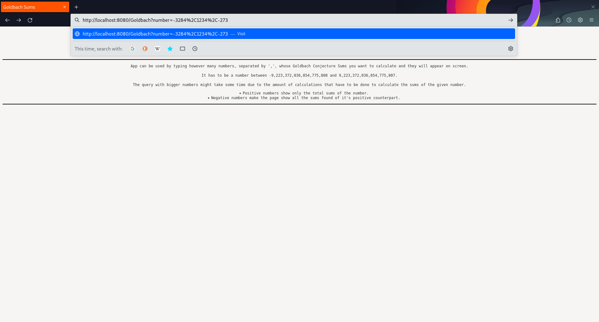
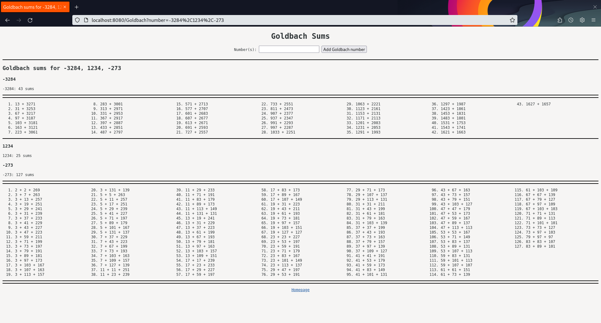
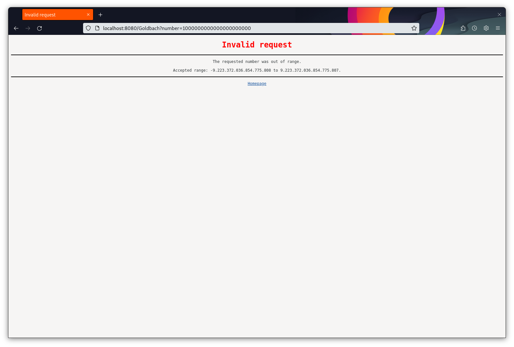

# Goldbach Concurrent Server

A high-performance multithreaded web server for calculating Goldbach Conjecture sums concurrently.

## Table of Contents
- [Overview](#overview)
- [Installation](#installation)
- [Usage](#usage)
- [Webpage](#webpage)
- [Examples](#examples)
- [Error Handling](#error-handling)
- [Contributing](#contributing)
- [License](#license)


## Overview

This project transforms a serial web server into a high-performance concurrent server capable of handling multiple client connections simultaneously. The server is designed to calculate the Goldbach Conjecture for user-provided numbers, showcasing the benefits of multithreading and concurrency in server design.

### Key Features
- Concurrent handling of multiple client connections.
- Goldbach Conjecture calculations for both positive and negative integers.
- Scalable architecture leveraging multithreading for efficient resource utilization.


## Installation

### Prerequisites
- A C++ compiler (e.g., GCC or Clang).
- `make` utility installed on your system.

### Steps
1. Clone the repository:
   ```bash
   git clone <repository-url>
   cd MPI_OPENMP_PTHREADS_Projects-main/project1.1
   ```
2. Compile the server using the provided `Makefile`:
   ```bash
   make
   ```
3. Run the server:
   ```bash
   bin/project1.1
   ```
4. Alternatively, compile and run in one step:
   ```bash
   make run
   ```


## Usage

### Starting the Server
Run the following command to start the server:
```bash
bin/project1.1
```

### Accessing the Server
Open a web browser and navigate to:
```
http://localhost:8080
```

### Example Requests
- Calculate Goldbach sums for a single number:
  ```
  http://localhost:8080/Goldbach?number=1234
  ```
- Calculate Goldbach sums for multiple numbers:
  ```
  http://localhost:8080/Goldbach?number=1234,5678,-91011
  ```

### Stopping the Server
Use the key combination:
```bash
CTRL-C
```


## Webpage

The web application allows users to calculate the Goldbach Conjecture for multiple numbers. Users can input numbers directly into the webpage, and the results will be displayed.

### Input Constraints
- Numbers must be between:
  ```
  -9,223,372,036,854,775,808 and 9,223,372,036,854,775,807
  ```
- Larger numbers may take longer to process due to computational complexity.

### Output Behavior
- **Positive Numbers**: Displays the total number of Goldbach sums.
- **Negative Numbers**: Displays all Goldbach sums for the positive counterpart.


## Examples

### Homepage
The homepage provides a simple interface for users to input numbers and view the results of the Goldbach Conjecture calculations.



### Querying by URI
Users can query the server directly using URIs. For example:
```
http://localhost:8080/Goldbach?number=1234
```



### Displaying Results
The server can process multiple numbers in a single query. The results are displayed as shown below:




## Error Handling

If a user provides a number outside the valid range, the server responds with an error message, as shown below:



### Common Errors
- **Invalid Input**: Ensure all inputs are integers within the valid range.
- **Server Unreachable**: Verify that the server is running and accessible at `localhost:8080`.